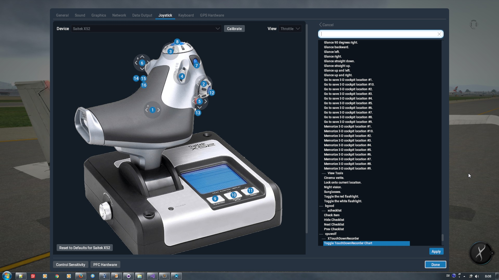
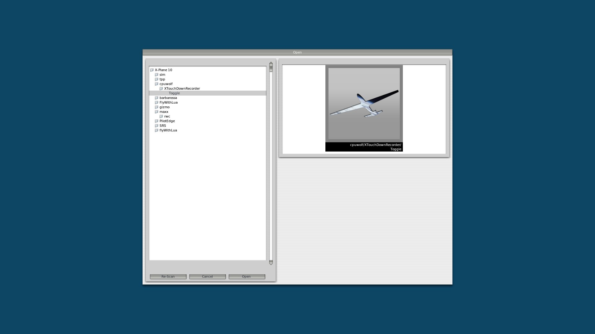
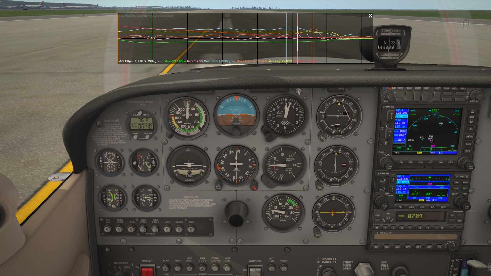
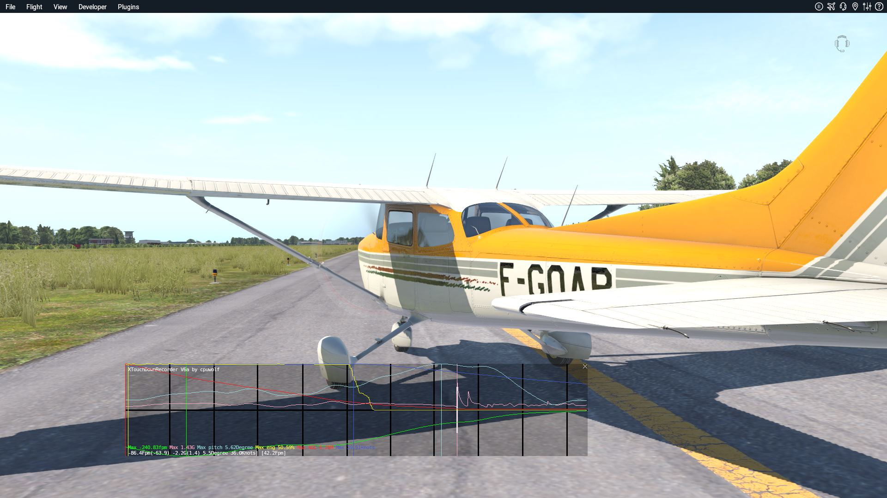
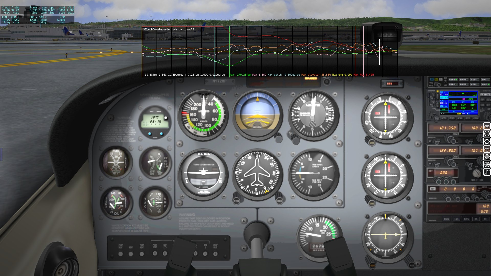

# XTouchDownRecorder
X-Plane 10/11 aircraft landing touch down flight recorder

it is used for aircraft landing data analysis

it supports Windows, Mac, Linux x64 only

## feature ##

* landing fpm, pitch, G force
* touch ground times
* max fpm,pitch, G force around landing
* landing log will be automatically written to log file TouchDownRecorderLog.txt
* automatically pop up after landing
* button/key assignment
* :thumbsup:[XTouchDownRecorder Community!](https://x-plane.vip/xtdr/)

## XTouchDownRecorder Community ##

** click ** here open a new world

## Installation

1. unzip and move XTouchDownRecorder to X-Plane 11\Resources\plugins\
1. re-start X-Plane
1. check X-Plane Plugin menu, there will be a "XTouchDownRecorder"

## Joystick button/key assignment ##

assign button/key to cpuwolf/XTouchDownRecorder/Toggle TouchDownRecorder Chart

## Screenshot on X-Plane 11 ##

## Screenshot on X-Plane 10 ##

## How to Look into it ##

## Thanks to leecbaker ##

this project starts with

https://github.com/leecbaker/xplane_sdk

## Contact Me ##

https://www.paypal.me/cpuwolf

https://www.patreon.com/cpuwolf

https://x-plane.vip/xtdr/

QQ群：378072629
