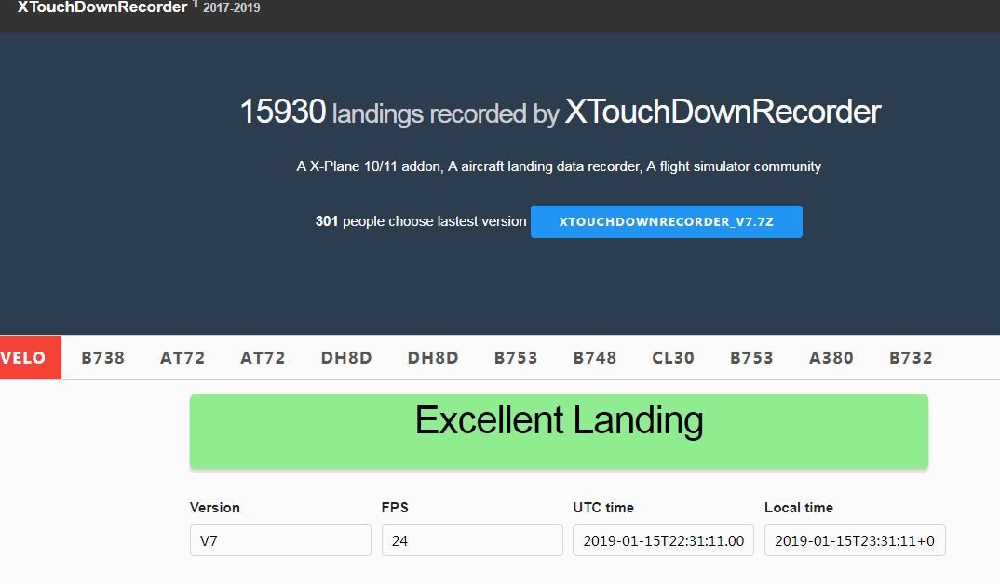
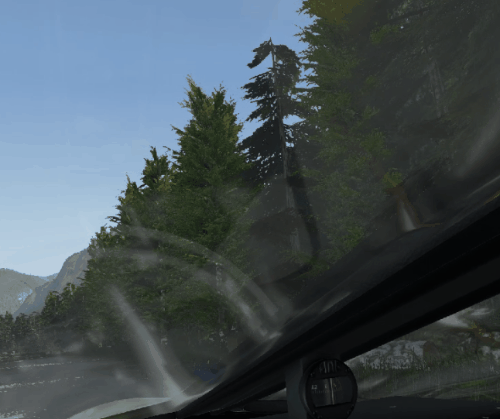
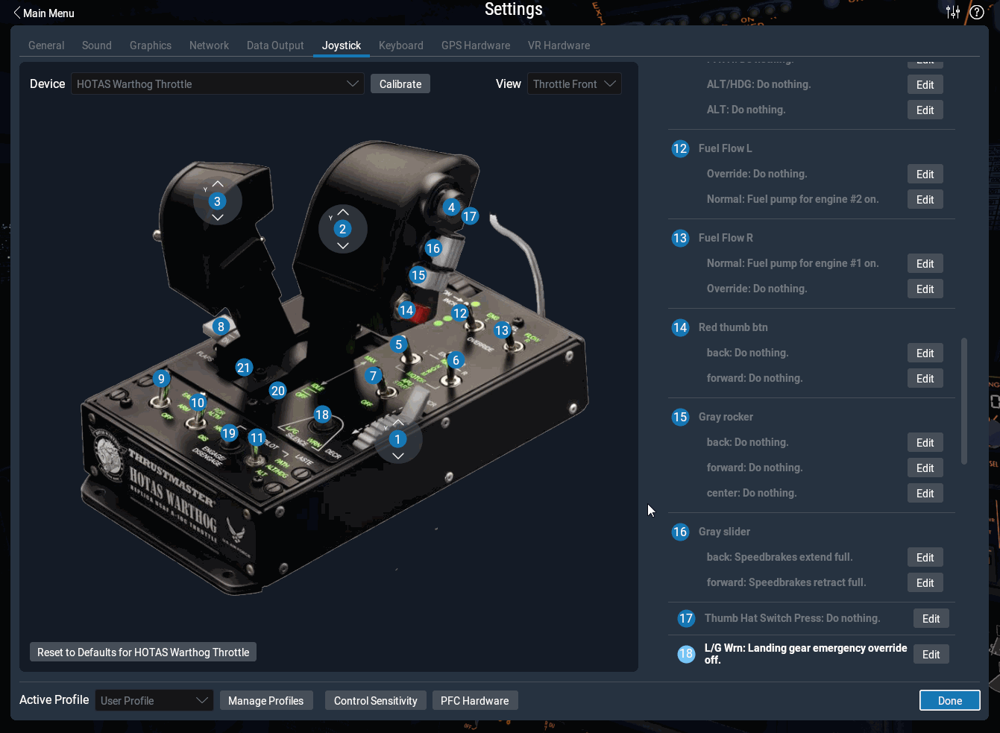
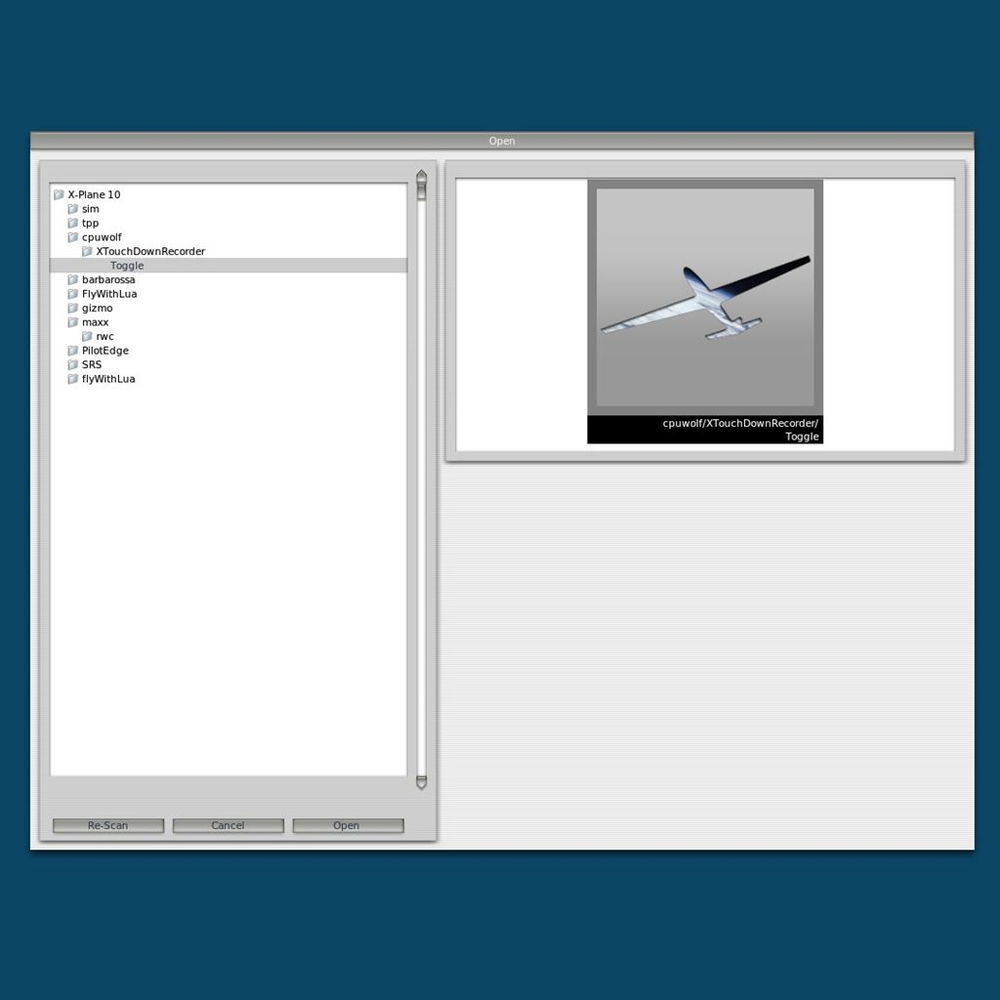
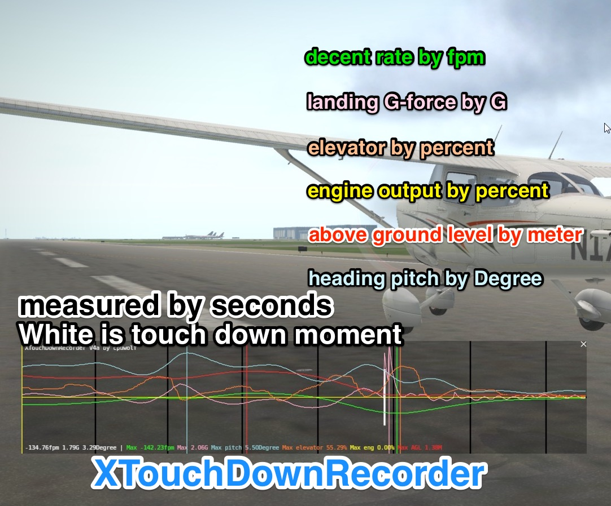
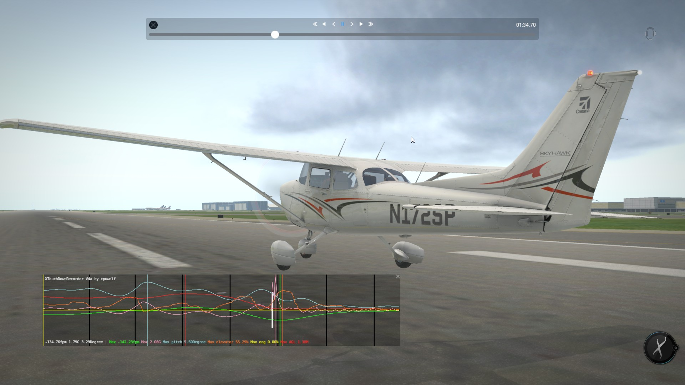
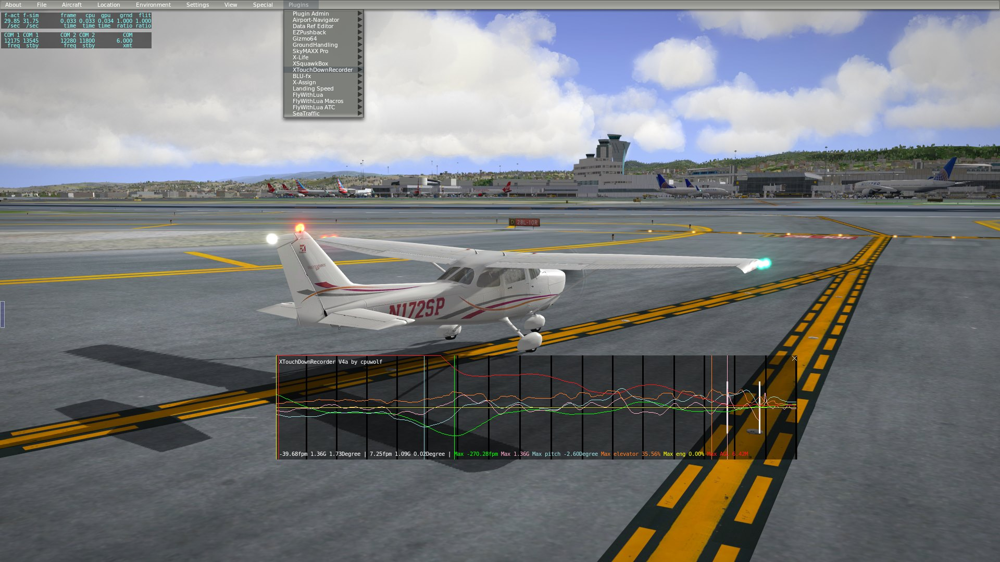

# ✈️ XTouchDownRecorder
### The Ultimate Landing Analysis Tool for X-Plane 10/11/12

**Master your landings.** XTouchDownRecorder is a comprehensive flight data recorder designed specifically to analyze aircraft touchdown performance. Whether you are a casual simmer or training for realism, get immediate feedback on your landing rate, G-force, and pitch.

  

---

## ✨ Key Features

Don't just guess how your landing went—know exactly what happened.

*   **📊 Precise Metrics:** Instantly view Landing Rate (FPM), Pitch angle, and G-Force upon touchdown.
*   **📉 Deep Analysis:** tracks Max FPM, Max Pitch, and Peak G-Force surrounding the landing event.
*   **🦘 Bounce Detection:** accurately records "Touch ground times" to detect bounced landings.
*   **☁️ Cloud Community:** Automatically sync your landings to the [XTouchDownRecorder Community](https://x-plane.vip/xtdr/) to compare with others.
*   **💾 Auto-Logging:** Every landing is saved locally to `TouchDownRecorderLog.txt` for your records.
*   **👓 VR Ready:** Fully optimized for Virtual Reality users.
*   **⚡ Instant Feedback:** The analysis chart automatically pops up after landing (configurable via button/key assignment).
*   :apple:  lowest supported version 11.0 

---

## 🌐 The Community

**Join a new world of flight tracking.**
Upload your stats, compete with other pilots, and track your progress over time.

:thumbsup: **[Visit the XTouchDownRecorder Community](https://x-plane.vip/xtdr/)**

| Web Interface | VR Integration |
| :---: | :---: |
|  |  |

---

## 📺 See It In Action

---

## 📥 Installation

Getting started is easy. No complex installers required.

1.  **Download** the latest release.
2.  **Unzip** the package.
3.  **Move** the folder `XTouchDownRecorder` into your X-Plane plugins directory:
    `X-Plane 11\Resources\plugins\`
4.  **Launch** X-Plane.
5.  Verify installation by checking the X-Plane **Plugins** menu for *XTouchDownRecorder*.

---

## 🎮 Controls & Usage

To view your landing data on demand or toggle the window, you must assign a key or button in X-Plane.

**Assignment Path:**
`cpuwolf` -> `XTouchDownRecorder` -> `Toggle TouchDownRecorder Chart`

### Configuration Examples

**X-Plane 11**

**X-Plane 10**

---

## 📈 Data Analysis

Visualize your performance with detailed charts. Analyze your flare, touchdown point, and rollout stability.

**Screenshots:**
*   
*   

---

## ❤️ Support & Contact

If you enjoy this tool and it helps you become a better pilot, consider supporting the development!

*   **Support via Patreon:** [patreon.com/cpuwolf](https://www.patreon.com/cpuwolf)
*   **Donate via PayPal:** [paypal.me/cpuwolf](https://www.paypal.me/cpuwolf)
*   **QQ Group:** 378072629
