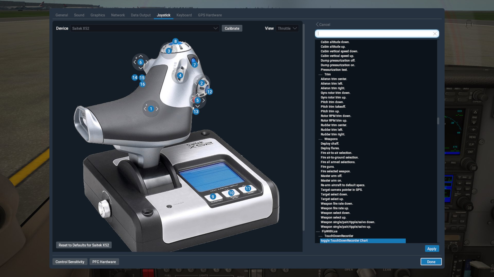
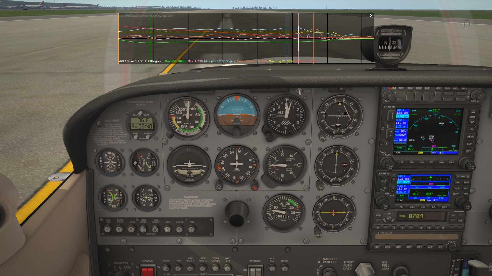
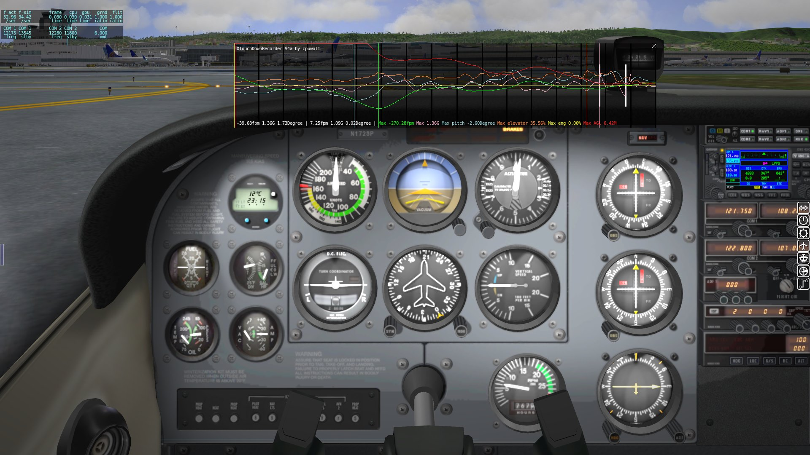

# XTouchDownRecorder
X-Plane 10/11 aircraft landing touch down flight recorder

it is used for aircraft landing data analysis

## feature ##

* touch ground times
* landing fpm, pitch, G force
* max fpm,pitch, G force around landing
* landing log will be automatically written to log file TouchDownRecorderLog.txt
* automatically pop up after landing
* button/key assignment

## maintain website ##

https://forums.x-plane.org/index.php?/files/file/39630-touchdownrecorder/

## Joystick button/key assignment ##

assign button/key to FlyWithLua/TouchDownRecorder/Toggle TouchDownRecorder Chart

## Screenshot on X-Plane 11 ##

## Screenshot on X-Plane 10 ##

## Thanks to leecbaker ##

this project starts with

https://github.com/leecbaker/xplane_sdk
